# Mypinpad Exercise Task

- [How to run locally](#how-to-run-locally)
- [List Transactions](#list-transactions)
- [Retrieve a transaction by ID](#retrieve-a-transaction-by-id)
- [Architecture - system design and decisions](#architecture---system-design-and-decisions)
  - [Integrity protection](#integrity-protection)
  - [Persistance and protection of sensitive data](#persistance-and-protection-of-sensitive-data)
  - [Masking sensitive data](#masking-sensitive-data)
  - [Decision](#decision)
  - [Transaction ID](#transaction-id)
  - [Error Handling](#error-handling)
  - [Key Handling and Storage](#key-handling-and-storage)
- [Threat Model & Security Notes](#threat-model--security-notes)
- [Notes during the development process](#notes-during-the-development-process)
- [Contacts](#contacts)

## How to run locally

1. Use Environment Variables for Local Deployment
    - Define your encryption keys as a system environment variables.
    - The key name in your appsettings.json should match the environment variable name.
    - For asymmetric encryption, the application requires two environment variables for each master key: one for the private key and one for the public key. The environment variables must follow this structure:
    ```
    <MasterKeyNameFromAppSetting>_PRIVATE_KEY
    <MasterKeyNameFromAppSetting>_PUBLIC_KEY
    ```
  
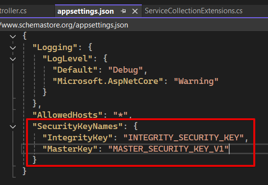
<br />

2. Open **MyPinPad.sln** with Visual Studio (2022)
<br />

3. This solution contains **two projects** that need to be run together (Right-click the solution → Set Startup Projects → choose Multiple startup projects.): 
    - **MyPinPan.WebApi** (.NET 8 Web API)
    - **MyPinPad.UI** (Blazor Web App) <br/><br/>

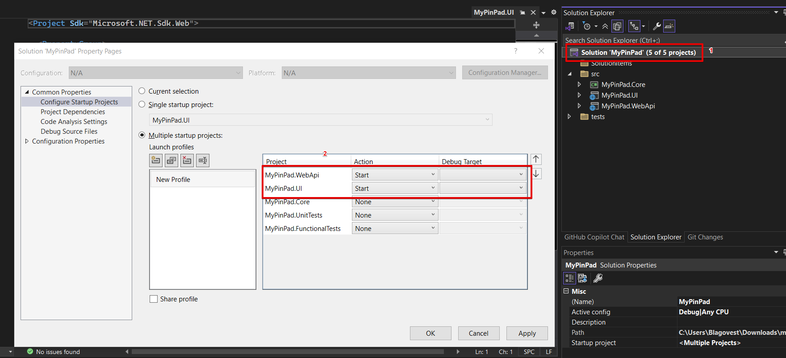
<br />


4. Once **MyPinPan.WebApi** is run, Swagger page is open in the browser, showing the API definitions.
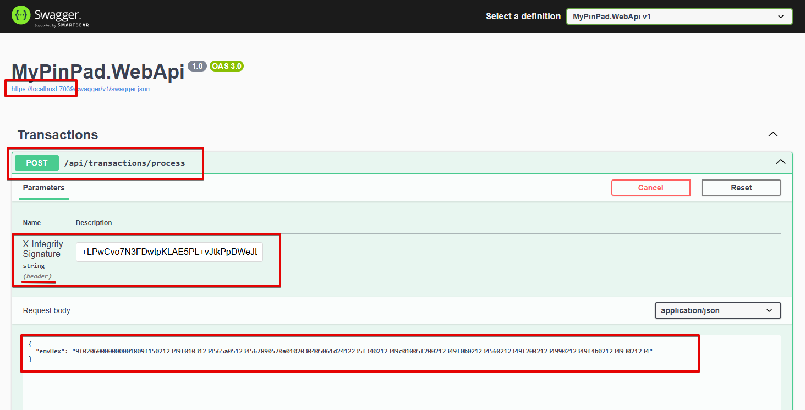
<br />

5. All created transactions can be viewed using **MyPinPan.UI**
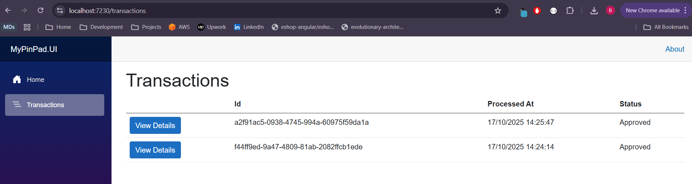
<br />

6. Transaction Details
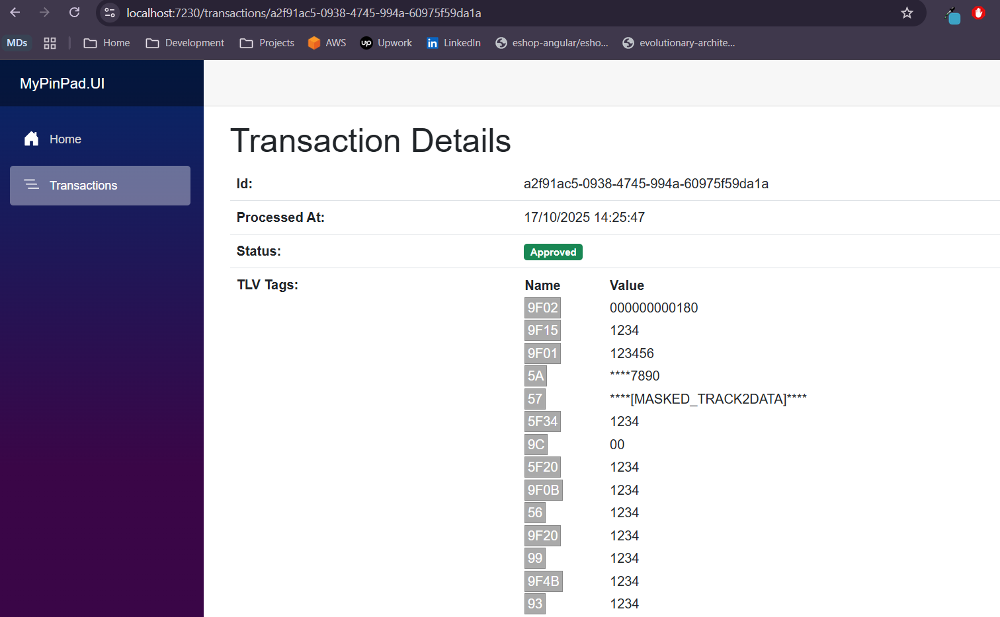

<br/>

## 🌐 MyPinPad.WebApi

### Create a transaction
In order to create a transaction you must send a POST request with **emvHex** in the body payload and integrity code into the headers using **X-Integrity-Signature**

**Request:**
```curl
curl -X 'POST' \
  'https://localhost:7039/api/transactions/process' \
  -H 'accept: text/plain' \
  -H 'X-Integrity-Signature: +LPwCvo7N3FDwtpKLAE5PL+vJtkPpDWeJLnG96ulHN8=' \
  -H 'Content-Type: application/json' \
  -d '{
  "emvHex": "9f02060000000001809f150212349f01031234565a051234567890570a0102030405061d2412235f340212349c01005f200212349f0b021234560212349f20021234990212349f4b02123493021234"
}'
```
<br/>

**Responses:**

**201 Created**
```json
{
  "id": "8a2d36a0-d626-41fb-b6ea-8d8eee9d74d6",
  "status": "Approved",
  "processedAt": "2025-10-16T22:49:56.143552Z",
  "tlvTags": {
    "56": "1234",
    "57": "****[MASKED_TRACK2DATA]****",
    "93": "1234",
    "99": "1234",
    "9F02": "000000000180",
    "9F15": "1234",
    "9F01": "123456",
    "5A": "****7890",
    "5F34": "1234",
    "9C": "00",
    "5F20": "1234",
    "9F0B": "1234",
    "9F20": "1234",
    "9F4B": "1234"
  }
}
```

**400 Bad Request**
```json

  "type": "https://tools.ietf.org/html/rfc9110#section-15.5.1",
  "title": "One or more validation errors occurred.",
  "status": 400,
  "errors": {
    "X-Integrity-Signature": [
      "The request signature is invalid or does not match the payload."
    ]
  },
  "traceId": "00-aad9fe699aeffdff31095de10045e4ee-1ae49c0b457dec09-00"
}
```

**500 Internal Server Error**
```json
{
  "type": "EMVParserException",
  "title": "An error occured while parsing EMV data 5A0854133300890200129F24032212315F2402",
  "status": 500
}
```

<br/><br/>

---
<br/>

### List transactions
Send a GET request to retrieve all created transactions

**Request**
```curl
curl -X 'GET' \
  'https://localhost:7039/api/transactions' \
  -H 'accept: text/plain'
```

**Responses:**

**200 OK**
```json
[
  {
    "id": "d109e1c1-aee1-462f-9363-fb39b050419f",
    "status": "Approved",
    "processedAt": "2025-10-16T22:44:37.4230219Z"
  },
  {
    "id": "8a2d36a0-d626-41fb-b6ea-8d8eee9d74d6",
    "status": "Approved",
    "processedAt": "2025-10-16T22:49:56.143552Z"
  }
]
```
<br/><br/>

---
<br/>

### Retrieve a transaction by ID
Send a GET request to get transaction details by its public id (GUID)
```curl
curl -X 'GET' \
  'https://localhost:7039/api/transactions/d109e1c1-aee1-462f-9363-fb39b050419f' \
  -H 'accept: text/plain'
```

**Responses:**

**200 OK**

```json
{
  "publicId": "8350c62b-2ed6-49ec-ab87-1be22125f208",
  "status": "Approved",
  "processedAt": "2025-10-16T23:08:54.3303573Z",
  "tlvTags": {
    "56": "1234",
    "57": "****[MASKED_TRACK2DATA]****",
    "93": "1234",
    "99": "1234",
    "9F02": "000000000180",
    "9F15": "1234",
    "9F01": "123456",
    "5A": "****7890",
    "5F34": "1234",
    "9C": "00",
    "5F20": "1234",
    "9F0B": "1234",
    "9F20": "1234",
    "9F4B": "1234"
  }
}
```

**404 Not Found**

<br/><br/>

---
<br/>

## Architecture - system design and decisions

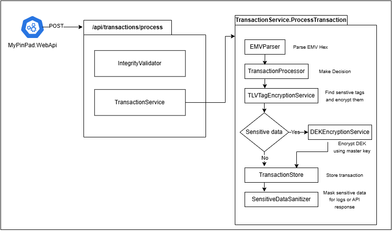

### Integrity protection
To ensure that transaction data has not been altered during transmission between the terminal and the API, `HMAC-SHA256` is implemented for message integrity verification. The SHA-256 algorithm provides a strong cryptographic hash function, while the HMAC (Hash-Based Message Authentication Code) mechanism adds a secret key to the hashing process. This combination ensures that:
- Any modification of the message data will result in a different hash value, allowing tampering to be detected.
- Only parties possessing the shared HMAC key can generate or verify valid message signatures, ensuring authenticity and trust.

In a production environment, the HMAC key must be securely managed and never stored in the application source code or configuration files. Instead, it should be stored in a cloud-based key management service, such as AWS Key Management Service (KMS) or Azure Key Vault, to ensure secure key storage, access control, and automated key rotation.

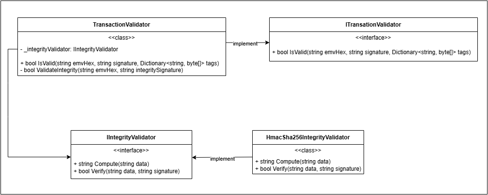

<br />

### Persistance and protection of sensitive data
Sensitive data such as PAN (Tag `5A`) and Track2 (Tag `57`) values are not masked when stored in the database. Masking is applied only when sensitive data is logged, displayed, or exposed externally (e.g., in logs, API responses, or user interfaces) where the original values are not required.

For data stored in the database, envelope encryption is implemented to ensure confidentiality and compliance with security standards.
In this approach:
- The sensitive tag values are encrypted using a symmetric key, referred to as the Data Encryption Key (DEK).
- The DEK itself is then encrypted using an asymmetric master key, known as the Key Encryption Key (KEK).
This dual-layer encryption model provides both security and performance advantages.

**Encryption Details**
- DEK encryption: AES-GCM with a 256-bit key. A unique nonce and authentication tag are generated and stored alongside the ciphertext for each record.
- KEK encryption: RSA with a 2048-bit key.

In a production environment, the KEK must be securely stored in a cloud-based Key Management Service (KMS) (e.g., AWS KMS or Azure Key Vault), with automated key rotation enabled.

**Key Management and Rotation**<br/>
A new DEK is generated for every transaction that contains sensitive data. The encrypted DEK is stored in the database together with its Key ID (key version).
Each transaction uses one DEK to encrypt and decrypt all sensitive fields within that transaction.
When the master key (KEK) is rotated, a re-encryption process is triggered:
1. The existing DEKs are decrypted using the old KEK.
2. Each DEK is re-encrypted with the new KEK.
3. The corresponding records are updated with the new encrypted DEKs and the new Key ID.
4. Once all data has been re-encrypted, the old KEK is securely deleted.

This design achieves:
- High performance - AES-256-GCM for efficient symmetric encryption.
- Strong security - RSA-2048 for secure key wrapping.
- Operational manageability - isolated key hierarchies, controlled key access, and smooth key rotation.

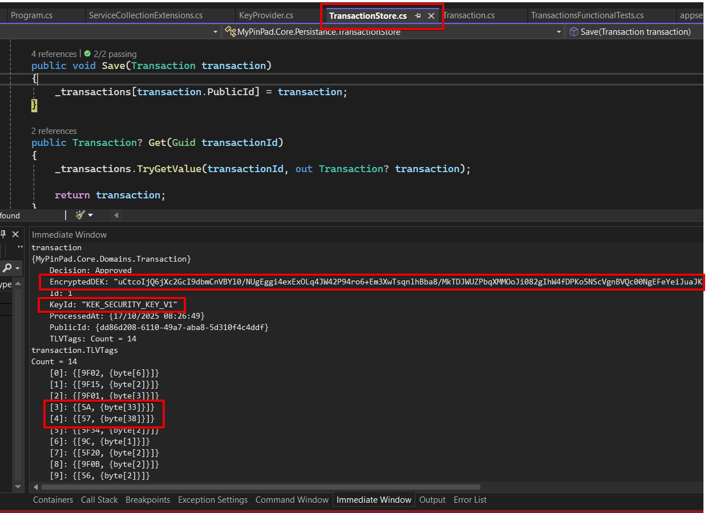

<br />

### Masking sensitive data
Different types of sensitive data require specific masking strategies to prevent exposure of confidential information while preserving usability. For example:
- PAN (Primary Account Number) can be masked as ****1234 (showing only the last four digits).
- Track2 data can be fully masked as [MASKED].

Masking is applied whenever sensitive data is logged, displayed, or exposed through APIs or other external interfaces. This ensures that no raw or unprotected sensitive information appears in logs, monitoring systems, or user-facing outputs. 

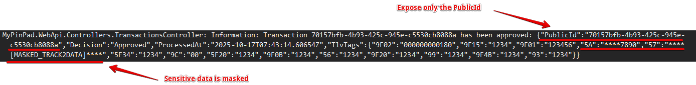

To support flexible and extensible sanitization, each specific sanitizer should implement the `ISensitiveDataSanitizerStrategy` interface, which defines the contract for the masking logic. All sanitizers are registered with the Dependency Injection (DI) container and managed by the SensitiveDataSanitizer class. This class is responsible for:
- Maintaining a registry of all available sanitizers.
- Selecting the correct sanitizer based on the tlv tag.

This design follows the Strategy Pattern, providing a clean separation of concerns, easy extensibility for new data types, and consistent enforcement of data protection across the application.
<br />

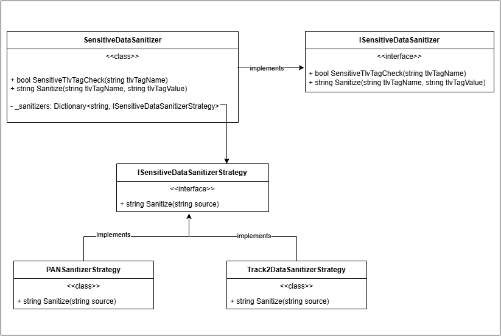

<br />

### Decision

In the current implementation, transaction approval is determined based on the transaction category. All transactions with category 00 (payments) are automatically marked as approved.

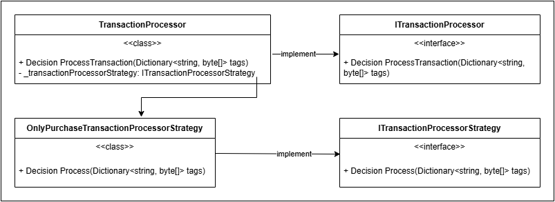

<br />

### Transaction ID

Each transaction has two identifiers: an internal ID (Id) and an external ID (PublicId).
- Internal ID (Id)
    - Chosen as a long number because, in a production environment with a real database, the primary key will typically be auto-incremented.
    - Using a GUID for the internal ID could lead to database fragmentation and performance issues.
- External ID (PublicId)
    - The internal ID should not be exposed outside the API because:
        - It is sequential, making it predictable to attackers.
        - It can leak system information (number of transactions)
    - Therefore, a separate **PublicId** field is introduced, which is a GUID
        - Hard to guess
        - Does not expose system state
        - Provides a secure reference for clients
<br/>

Transactions in this prototype are stored in-memory using a dictionary for fast lookup by ID. Since a real database is not used, a helper class **AutoIncrementIdGenerator** simulates auto-increment primary keys, mimicking standard database behavior. This approach allows the API to function realistically while keeping the implementation lightweight for development and testing.

<br />

### Error Handling
A centralized error handling middleware is implemented in the Web API project. This middleware ensures that all unhandled exceptions are caught and processed in a consistent and secure manner. It provides the following benefits:
- Consistent error responses across all API endpoints.
- Prevention of sensitive information leaks - internal exception details are never exposed to clients.
- Centralized logging of full exception details, including stack traces and inner exceptions, to support debugging and monitoring.

<br />

### Key Handling and Storage
For the purpose of this exercise task, the encryption keys are stored as system environment variables of the operation system. The developed API includes abstraction layer that allows easy switching from local key storage (environment variables) to a cloud-based key management solution. Keys should never be hardcoded in code or configuration files.

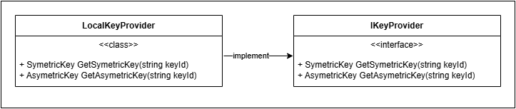

In production-ready application, encryption keys must never be stored directly in the application or database. Instead, a cloud-based key management service, such as AWS Key Management Service (KMS) or Azure Key Vault, should be used. Keys should be generated within the KMS and never exported in raw form.

Keys must also be rotated periodically using the automated rotation features provided by the KMS. A typical rotation schedule is every 90 days for sensitive keys and longer intervals for lower-risk keys. Automated rotation ensures minimal operational overhead and reduces the risk of key compromise.

<br />

### Communication between WebAPI and BlazorUI API
For robust, reliable, and fault-tolerant communication between the API and the UI application, Polly is used.
Polly provides resiliency patterns such as retries, circuit breakers, timeouts, and fallback strategies, which help the API handle transient failures in external calls gracefully. This ensures that temporary network issues or service unavailability do not negatively impact the user experience, while keeping the system stable and responsive.

<br />

## Threat Model & Security Notes

| Asset | Potential Threat | Security Notes |
|-------|-----------------|------------|
| Internal IDs | Enumeration / IDOR attacks | Use external GUIDs (`PublicId`) instead of exposing sequential IDs |
| Transaction Data | Data leakage | Envelop Encryption: <br /> - Encrypt sensitive data using AES-GCM <br /> - Encrypt data's encryption key using RSA |
| Encryption Keys | Key compromise | - Store in KMS/Vault <br/> - never hardcode <br/> - rotate regularly |
| API Endpoints | Unauthorized access | Require authentication & authorization |
| In-memory storage (dev only) | Data loss / access | Use secure persistent database in production |
| System Info | Information disclosure | Do not expose internal counters or database structure |

<br />

## Notes during the development process

According to the requirements, EMV transactions may arrive in two modes:
- Encrypted mode: sensitive tags (such as `5A` - PAN and `57` - Track2 Data) are protected.
- Plaintext mode: no sensitive tags are present in the transaction data.

However, the task includes only one sample EMV message:
```
9f02060000000001809f150212349f01031234565a051234567890570a0102030405061d2412235f340212349c01005f200212349f0b021234560212349f20021234990212349f4b02123493021234
```

This example contains the `5A` and `57` TLV tags, and their values appear in plaintext
(5A = 1234567890, 57 = 0102030405061D241223), meaning they are not encrypted.

To remain consistent with the provided input example, the current implementation assumes that the term "encrypted mode" in the requirements refers to an EMV message that includes sensitive data in plaintext, rather than one where the sensitive data itself is already encrypted.

**Note:** If `5A` and `57` tags should come to the API in encrypted format, I am ready to present the code that decrypt the sensitive tag data from the request at the next interview step.

<br />

## Contacts

If you require any additional information or clarification, please feel free to contact me:<br/>
**Email:** razhenkov@gmail.com <br/>
**LinkedIn:** https://www.linkedin.com/in/blagovestrazhenkov/

I'll be happy to provide further details or answer any questions regarding this implementation.